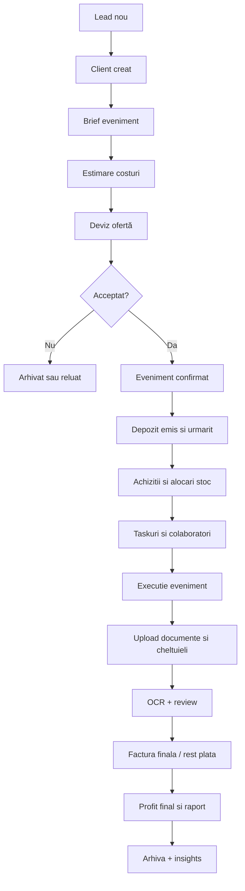
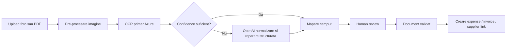
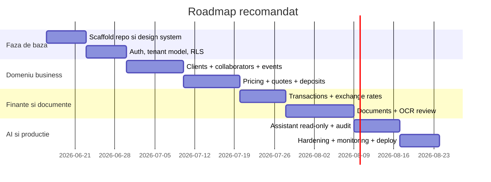

# Blueprint de implementare pentru un dashboard PWA mobil-first pentru o afacere de decorațiuni de evenimente din România

> **Note de implementare (actualizat 2026-06-17).** Decizii confirmate care actualizează acest blueprint:
> - **UI:** se folosește **MUI Material** (`@mui/material`), nu MUI Joy. Joy este în mod maintenance upstream; Material este activ dezvoltat și se integrează curat cu MUI X. SSR prin registru Emotion propriu (`useServerInsertedHTML`). Vezi [ADR 2026-06-17](docs/architecture/adr/2026-06-17-monorepo-and-mui-material.md).
> - **Monorepo:** structura `apps/web` + `packages/*` se implementează cu **npm workspaces** (nu pnpm — npm este toolchain-ul proiectului). Pachete: `@mali/config`, `@mali/types`, `@mali/utils`.
> - **Bază de date:** acest proiect se conectează EXCLUSIV la propriul Supabase (`rtnuhqjpqqdyelzlmbkq`). Vezi `AGENTS.md` / `DEV_RULES.md`.

## Rezumat executiv

Acest raport transformă brief-ul tău într-un plan central de produs și dezvoltare care poate ghida direct Codex, Cursor sau alți agenți. Am tratat cerințele din conversație și fișierul încărcat ca specificație de bază pentru soluție. fileciteturn0file0

Recomandarea de ansamblu pentru MVP este: **Next.js + TypeScript + App Router + PWA + Supabase + Postgres + Storage + Auth + RLS + Vercel**, cu **Azure Document Intelligence** pentru OCR-ul inițial al facturilor/chitanțelor în limba română și **OpenAI** pentru normalizare semantică, validare a câmpurilor extrase și interogări în limbaj natural. Alegerea PWA este justificată pentru că Next.js documentează explicit suportul pentru manifest, service worker, cache, push notifications și instalabilitate, inclusiv ca alternativă serioasă la aplicații native pentru cazuri în care vrei un singur codebase web-first. citeturn6view1turn6view2turn43view1

Pentru date și autorizare, **Supabase** se potrivește mai bine decât **Firebase Firestore** fiindcă soluția ta este în mod fundamental **relațională**: evenimente, devize, colaboratori, linii de cost, depozite, documente, cursuri valutare istorice, audit și permisiuni per rând. Documentația Supabase arată integrarea strânsă dintre Auth, Postgres și RLS, iar documentația Firebase explică faptul că Firestore este o bază NoSQL orientată pe documente, fără modelul clasic de tabele și relații SQL. Pentru un sistem financiar și operațional, aceasta înclină clar balanța către Postgres. citeturn32view0turn51view3turn51view4turn51view0turn33view0

Pentru OCR, concluzia cu cel mai mare grad de încredere este: **AWS Textract nu este alegerea corectă pentru MVP în România**, deoarece documentația AWS menționează suport pentru detecția textului doar pentru engleză, franceză, germană, italiană, portugheză și spaniolă; nu și română. În schimb, **Azure Document Intelligence** are modele predefinite pentru invoice și receipt și suport OCR multilingv care include româna, iar **Google Vision** suportă româna, dar propria documentație Google recomandă **Document AI** dacă obiectivul este OCR pentru documente scanate cu parsare de formulare și entități. **OpenAI Vision** este util pentru validare și structurare, dar documentația sa subliniază limitări la text mic, rotații, localizare spațială exactă și acuratețe variabilă, deci nu ar trebui să fie singurul motor de extracție contabilă. citeturn24view2turn24view3turn31view1turn31view0turn30view4turn31view3turn31view4turn30view0turn27view0turn27view1

Pentru curs valutar, recomandarea este **BNR ca sursă primară pentru operațiuni contabile în România**, cu **ECB ca fallback/validare și sursă suplimentară de time series**. BNR expune oficial un punct „Curs XML” pe site-ul său, iar ECB publică rate de referință EUR, actualizate în zile lucrătoare, cu descărcări CSV/XML și time series. În practică, aplicația trebuie să salveze **snapshot-ul de curs utilizat la momentul calculului**, nu doar să recalculeze „la zi”, pentru a păstra consistența financiară și auditabilitatea. citeturn10view0turn42view0turn42view1

Din perspectivă legală și de conformitate, două direcții trebuie tratate din prima versiune de arhitectură: **GDPR** și **capacitatea de integrare ulterioară cu e-Factura/ANAF**. Comisia Europeană confirmă că GDPR se aplică din 25 mai 2018 și reprezintă cadrul principal pentru prelucrarea datelor cu caracter personal, iar Ministerul Finanțelor are portalul oficial RO e-Factura. Pentru cerințele concrete de retenție fiscală, fluxurile exacte e-Factura, obligațiile pe cod CAEN, particularitățile statutului tău de TVA și regulile contabile privind cursurile utilizate în registre, recomandarea mea este să tratezi aceste puncte ca **parametrizabile în produs** și să le validezi cu contabilul înainte de lansare. citeturn35view0turn36view0turn20view3turn46view0

## Viziune, roluri și module

### Viziunea de produs

Produsul propus este un **sistem operațional de business** pentru o firmă de decorațiuni de evenimente, nu doar un dashboard de raportare. El trebuie să acopere patru nevoi simultan: operare mobilă zilnică, control financiar real, arhivă documentară inteligentă și un strat AI sigur care să răspundă la întrebări și să facă calcule fără să ocolească regulile financiare și de acces. Caracterul mobil-first și PWA este important deoarece activitatea include poze/scanare de documente din teren, recepție de materiale, revizuire rapidă a costurilor și acces imediat la starea unui eveniment. Next.js documentează exact tipul de capabilități PWA necesare aici: service worker, manifest, cache, instalabilitate și notificări. citeturn6view1turn6view2

### Rolurile și regulile exacte de acces

Modelul de permisiuni trebuie să fie construit de la început pe **least privilege** și aplicat în baza de date prin RLS, nu doar în UI. Supabase recomandă explicit RLS pentru acces granular și precizează că, odată activat, datele nu sunt accesibile prin API până când nu există politici explicite; Storage urmează aceeași logică prin politici pe `storage.objects`. citeturn51view0turn51view2turn50view0turn50view5

| Rol | Poate vedea | Poate crea/edita | Poate aproba | Nu poate |
|---|---|---|---|---|
| **Owner** | Tot ce aparține organizației | Tot | Devize, prețuri, evenimente, documente, utilizatori, cursuri manual override | Nimic în organizația sa, în afara limitelor de sistem |
| **Partner** | Toate evenimentele, rapoarte și documentele permise | Evenimente, clienți, colaboratori, stoc, costuri, devize | Poate aproba devize și costuri dacă owner activează acest drept | Nu poate modifica setări fiscale globale fără drept explicit |
| **Collaborator** | Doar evenimentele și taskurile atribuite; doar documentele legate de acestea | Taskuri, check-ins, cheltuieli proprii, documente proprii | Nu | Nu vede profit global, salarii, alte evenimente, alți colaboratori decât dacă sunt pe același eveniment |
| **Accountant** | Documente financiare, tranzacții, exporturi, jurnale TVA, setări fiscale | Clasificare contabilă, reconciliere, note fiscale, exporturi | Poate valida documentele financiar-fiscale | Nu vede note interne comerciale, conversații interne, date operaționale irelevante |
| **Future client user** | Doar propriile oferte, contracte, programări și livrabilele partajate | Confirmări, semnături, upload de brief/foto, plăți dacă vei adăuga integrarea | Acceptare ofertă / confirmare milestone | Nu vede costuri interne, colaboratori, marje, alte evenimente |

**Reguli exacte de acces recomandate:**

1. `owner` și `partner` citesc toate rândurile din organizație; diferența este la setările sensibile.
2. `accountant` are acces doar la tabele financiare, documente contabile și exporturi.
3. `collaborator` are acces doar la evenimentele din `event_assignments`.
4. documentele din Storage sunt accesibile doar dacă există o relație validă între utilizator, organizație și entitatea documentului.
5. AI assistant răspunde numai în granițele permisiunilor RLS ale utilizatorului; nu i se permit interogări cu service key.
6. orice răspuns AI care conține totaluri, profit, taxă sau sold trebuie să includă link intern către rândurile sursă și intrare de audit.

### Modulele de bază

| Modul | Scop | MVP | Advanced | Entități principale |
|---|---|---|---|---|
| **Dashboard** | stare business | KPI, upcoming events, cash snapshot, documente în review | forecast, anomaly alerts, scenario planning | organizations, events, financial_transactions |
| **CRM clienți** | lead-uri și relații | clienți, contacte, note, sursă lead | pipeline, follow-ups automate, client portal | clients, client_contacts, leads |
| **Evenimente** | operare cap-coadă | brief, ofertă, status, taskuri, costuri, timeline | checklists complexe, Gantt, recurring patterns | events, event_items, event_tasks |
| **Devize și pricing** | calcul ofertă | catalog produse/servicii, formule, marje, depozit | variante de ofertă, discount policy engine | price_catalog, quotes, quote_lines |
| **Finanțe** | venituri/cheltuieli | încasări, plăți, expense categories, profit per event | reconciliere bancară, forecast cashflow | financial_transactions, expense_claims |
| **Documente** | arhivă facturi/bonuri | upload, OCR, review, link la event/supplier/client | versioning, auto-classification, export pachet contabil | documents, document_extractions |
| **Stoc și active** | ce ai cumpărat și ce deții | active, consumabile, achiziții | kit-uri, rezervări pe eveniment, depreciere | inventory_items, inventory_movements |
| **Colaboratori** | oameni și costuri | profil, rol, rate, disponibilitate | payroll-like estimates, scoring | collaborators, collaborator_rates |
| **AI assistant** | întrebări și calcule | read-only Q&A, explainers | copilots per screen, proactive suggestions | ai_sessions, ai_audit_logs |

### Domeniul minim obligatoriu pentru MVP

MVP-ul trebuie să rezolve fără compromis următoarele scenarii: creare eveniment, generare deviz, urmărire depozit, înregistrare cheltuieli, scanare și verificare documente, raport net/gross/profit per eveniment, listă de active cumpărate și colaboratori, plus întrebări de tip „cât am cheltuit pe evenimentul X?”, „ce documente mai sunt nevalidate?”, „care este profitul estimat dacă accept oferta Y?”. Tot ceea ce nu contribuie direct la aceste fluxuri poate fi împins în roadmap-ul post-MVP. citeturn33view8turn26view0turn26view1

## Flux operațional, prețuri și finanțe

### Ciclu complet al unui eveniment



Fluxul trebuie să accepte și deviații: ofertă neacceptată, eveniment amânat, anulare cu depozit parțial nerambursabil, costuri apărute după eveniment, documente urcate după închidere, diferențe de curs valutar, split payments, cheltuieli personale ce trebuie decontate, colaboratori schimbați în ultima clipă, materiale cumpărate pentru stoc dar folosite doar parțial pe eveniment. Aceste situații sunt motivul pentru care designul trebuie să fie orientat pe **stări** și **snapshot-uri**, nu doar pe valori curente. citeturn42view0turn46view0

### Stările recomandate pentru eveniment

`draft → inquiry → quoted → accepted → deposit_pending → scheduled → in_preparation → in_progress → completed → invoiced_final → paid → archived`

**Stări auxiliare:** `cancelled`, `postponed`, `requires_review`, `over_budget`, `documents_missing`

### Motorul de pricing

Modelul de pricing trebuie să fie capabil să calculeze **cost intern**, **preț client**, **depozit**, **TVA**, **marjă** și **profit estimat/final** în RON și EUR. Pentru facturare în UE, Comisia Europeană precizează că facturile electronice sunt echivalente cu cele pe hârtie și enumeră informațiile standard ale unei facturi TVA: dată, număr unic secvențial, furnizor, client, identificare fiscală acolo unde e cazul, descriere, cantitate, preț unitar fără taxă, data livrării/plății dacă diferă, cota și suma TVA, defalcarea TVA sau mențiunea de scutire, plus alte mențiuni specifice unor regimuri speciale. citeturn46view0

#### Formule recomandate

```text
line_cost_net =
  material_cost_net
+ labor_cost_net
+ transport_cost_net
+ third_party_cost_net
+ overhead_allocated_net

line_sale_net =
  case pricing_mode
    when 'cost_plus' then round(line_cost_net * (1 + markup_pct), 2)
    when 'target_margin' then round(line_cost_net / (1 - target_margin_pct), 2)
    when 'fixed' then fixed_price_net
  end

quote_subtotal_net = sum(line_sale_net)
quote_discount_net = round(quote_subtotal_net * discount_pct, 2) + fixed_discount_net
quote_net_after_discount = quote_subtotal_net - quote_discount_net
quote_vat_amount = round(quote_net_after_discount * vat_rate, 2)
quote_total_gross = quote_net_after_discount + quote_vat_amount

deposit_due =
  case deposit_type
    when 'percent_gross' then round(quote_total_gross * deposit_pct, 2)
    when 'percent_net' then round(quote_net_after_discount * deposit_pct, 2)
    when 'fixed' then fixed_deposit_amount
  end

estimated_profit_net =
  quote_net_after_discount - estimated_total_cost_net

estimated_margin_pct =
  case when quote_net_after_discount > 0
    then round(estimated_profit_net / quote_net_after_discount, 4)
  end
```

#### Reguli de rotunjire recomandate

1. sumele monetare se stochează în `NUMERIC(14,2)` sau în „minor units” dacă vrei strictețe totală;
2. calculele de linie se rotunjesc la 2 zecimale după formula fiecărei linii;
3. totalul documentului se recalculează din liniile rotunjite;
4. conversiile valutare se fac la 6 zecimale intern, dar se afișează la 2 zecimale;
5. fiecare ofertă/factură/încasare păstrează **cursul snapshot** folosit la momentul documentului, chiar dacă există recalculări ulterioare;
6. rapoartele manageriale pot folosi și re-evaluare la curs curent, dar separat de evidența documentară.

### Metrici financiare recomandate

| Grup | KPI minim |
|---|---|
| **Cash** | cash in, cash out, sold, depozite încasate, rest de facturat, rest de încasat |
| **Evenimente** | venit estimat, venit final, cost estimat, cost final, profit net/gross, marjă |
| **Operațional** | cost materiale, cost colaboratori, cost transport, cost subînchirieri, cost logistic |
| **Documente** | documente noi, documente nevalidate, documente cu OCR slab, documente fără asociere |
| **Clienți** | rate de acceptare ofertă, valoare medie eveniment, clienți repetați |
| **Stoc** | active achiziționate, consumabile folosite, lipsuri, valoare stoc |

### Categorii recomandate de cheltuieli

| Clasă | Categorii |
|---|---|
| **Materiale** | baloane, flori, textile, lumini, structură, papetărie, printuri, recuzită |
| **Logistică** | transport, combustibil, curier, parcare, depozitare, montaj/demontaj |
| **Resurse umane** | colaboratori, freelanceri, design, montaj, photo/video subcontractat |
| **Servicii externe** | închiriere echipamente, producție print, atelier, curățenie |
| **Administrative** | telefoane, software, accounting, hosting, marketing, bancă |
| **Capital / active** | unelte, standuri, decorațiuni reutilizabile, echipamente foto, imprimante, rafturi |

### Sistemul de curs valutar

ECB publică rate de referință EUR și oferă inclusiv descărcări XML/CSV și time series. BNR oferă oficial un punct XML pentru cursuri pe site-ul său. Pentru business-ul tău, modelul corect este: **sursă primară BNR pentru rapoarte și justificări locale**, **fallback ECB pentru reziliență tehnică și validare**, plus caching și snapshot per document. Ratele ECB sunt actualizate în jurul orei 16:00 CET, în zilele lucrătoare, și sunt publicate doar în scop informativ; de aceea aplicația trebuie să păstreze sursa și data utilizată și să trateze regulile fiscale ca parametru configurabil verificat cu contabilul. citeturn10view0turn42view0turn42view1

#### Recomandare operațională

- `source_priority = ['BNR', 'ECB']`
- `base_reporting_currency = 'RON'`
- `supported_currencies = ['RON', 'EUR']`
- dacă documentul este în EUR, stochezi:
  - suma în EUR,
  - cursul istoric,
  - suma convertită în RON,
  - data cursului,
  - sursa cursului,
  - regula aplicată (`transaction_date`, `prior_business_day`, `manual_override`)

#### Model SQL recomandat pentru cursuri

Mai jos este o schemă exemplificativă, orientată pe auditabilitate:

```sql
create table public.exchange_rates (
  id bigserial primary key,
  source text not null check (source in ('BNR', 'ECB', 'MANUAL')),
  rate_date date not null,
  base_currency char(3) not null,
  quote_currency char(3) not null,
  rate numeric(18,8) not null,
  inverse_rate numeric(18,8) generated always as (
    case when rate <> 0 then 1 / rate else null end
  ) stored,
  published_at timestamptz,
  fetched_at timestamptz not null default now(),
  raw_payload_hash text,
  is_final boolean not null default true,
  notes text,
  unique (source, rate_date, base_currency, quote_currency)
);

create index idx_exchange_rates_lookup
  on public.exchange_rates (rate_date desc, source, base_currency, quote_currency);
```

#### Reguli de caching recomandate

- fetch zilnic la 16:30 Europe/Bucharest;
- retry la 17:00 și 18:00 dacă sursa principală nu răspunde;
- cache dur în DB;
- interdicție de „live recalculation” pentru documente deja emise;
- fallback la ultimul curs disponibil numai pentru **estimări interne**, niciodată pentru documente fiscale fără validare contabilă.

## Arhitectură tehnică și date

### De ce stack-ul recomandat este Next.js, TypeScript și Supabase

Documentația Next.js pentru PWAs descrie exact mecanismele de care ai nevoie: manifest, service worker, cache, push notifications, instalabilitate și experiență apropiată de nativ. Supabase oferă Postgres, Auth, RLS și Storage cu politici fine, iar pgvector și full-text search pot fi adăugate ulterior dacă AI-ul are nevoie de semantic retrieval. Firebase Auth este solid, dar Firestore este NoSQL orientat pe documente; pentru un ERP mic financiar, acest lucru complică formulele, agregările, rapoartele consistente și autorizarea pe relații multiple. Postgres rămâne alegerea corectă pentru devize, tranzacții, documente și audit. citeturn6view1turn32view0turn51view3turn51view4turn50view5turn33view4turn33view8turn33view0

### Evaluare scurtă a opțiunilor

| Decizie | Opțiune recomandată | De ce |
|---|---|---|
| Frontend | **Next.js + React + TypeScript** | PWA, SSR/ISR, route handlers, ecosistem solid |
| UI | **MUI Material + MUI X selectiv** | componente mature, formulare și tabele bune pe mobil (vezi nota de implementare) |
| Backend | **Supabase + SQL RPC + route handlers** | reduce infrastructura pentru MVP |
| DB | **Postgres** | relații, SQL, agregări, audit, extensibilitate |
| Auth | **Supabase Auth** | integrare directă cu RLS și Postgres |
| Storage | **Supabase Storage** | politici pe fișiere și directoare, bucket-uri pentru PDF/JPG |
| Deploy | **Vercel** | pipeline foarte bun pentru Next.js; cron și observabilitate disponibile |
| Jobs | **Vercel Cron + worker/server routes**, eventual `pg_cron` | rate, OCR queue, retries |
| Vector DB | **Nu în MVP** | SQL + metadate + full-text ajung inițial |
| Native app | **Nu în MVP** | PWA e suficientă pentru scanare, operare și instalare |

Documentația Supabase arată explicit că RLS este baza autorizării, că Auth folosește Postgres dedesubt și că Storage poate aplica politici fine pe `storage.objects`. Documentația Firebase arată clar modelul schemaless orientat pe colecții și documente, ceea ce este mai puțin potrivit pentru contabilitate și pricing relațional. citeturn51view0turn51view2turn51view3turn51view4turn50view0turn50view5turn33view0

### Structura recomandată a repo-ului

```text
apps/
  web/
    app/
      (auth)/
      dashboard/
      events/
      clients/
      finance/
      documents/
      inventory/
      collaborators/
      pricing/
      assistant/
      settings/
      api/
    components/
      ui/
      layout/
      forms/
      charts/
      domain/
    lib/
      auth/
      db/
      money/
      fx/
      permissions/
      documents/
      ai/
      validation/
    hooks/
    styles/
    tests/
packages/
  config/
  types/
  utils/
supabase/
  migrations/
  seed/
  policies/
  functions/
docs/
  adr/
  db/
  api/
  ux/
```

### Modelul de date Postgres recomandat

Tabelele de mai jos acoperă MVP-ul și extensia spre multi-user/multi-partner:

| Tabel | Câmpuri cheie | Relații | Indexuri cheie | Observații |
|---|---|---|---|---|
| `organizations` | id, name, base_currency, vat_mode | 1:N cu aproape tot | slug, active | multi-tenant |
| `organization_users` | organization_id, user_id, role, permissions_json | auth.users | unique(org,user) | pentru roluri viitoare |
| `clients` | id, organization_id, name, type, tax_id | events, quotes, invoices | organization_id,name | persoane/firme |
| `client_contacts` | client_id, name, phone, email | clients | client_id | contacte multiple |
| `collaborators` | org_id, name, role_type, notes | collaborator_rates, event_assignments | org_id,status | intern/extern |
| `collaborator_rates` | collaborator_id, pricing_mode, rate | collaborators | collaborator_id,valid_from | cost intern |
| `events` | id, org_id, client_id, title, status, event_date, venue, currency | quotes, tasks, docs, tx | org_id,event_date,status | entitatea centrală |
| `event_assignments` | event_id, collaborator_id, role, cost_mode | events, collaborators | event_id, collaborator_id | cine lucrează unde |
| `event_tasks` | event_id, title, due_at, assignee_id, status | events | event_id,status,due_at | checklist-uri |
| `price_catalog` | org_id, sku, type, name, default_price, default_cost | quote_lines | org_id,sku | reusable pricing |
| `quotes` | event_id, version_no, status, currency, totals | events | event_id,version_no | multiple versiuni |
| `quote_lines` | quote_id, catalog_item_id, qty, unit_price, unit_cost, vat_rate | quotes | quote_id, sort_order | snapshot complet |
| `invoices` | event_id/client_id, number, status, currency, issued_at | payments, docs | number, issued_at | intern sau integrat |
| `invoice_lines` | invoice_id, description, qty, unit_price, vat_rate | invoices | invoice_id | snapshot |
| `financial_transactions` | org_id, event_id, type, direction, amount, currency, rate_snapshot | clients, docs | event_id, tx_date, type | venituri/cheltuieli |
| `expense_claims` | submitted_by, event_id, category_id, amount | docs, tx | status, submitted_at | flow de audit |
| `expense_categories` | org_id, code, name, parent_id | expense_claims | code | configurabil |
| `documents` | org_id, event_id, file_path, mime_type, doc_type, ocr_status | extractions | org_id, entity refs | PDF/JPG/PNG |
| `document_extractions` | document_id, engine, status, confidence, raw_json | documents | document_id, engine | rezultate OCR |
| `document_fields` | extraction_id, field_name, field_value, confidence | extractions | extraction_id, field_name | review friendly |
| `inventory_items` | org_id, sku, name, category, reusable | movements | org_id, sku | active + consumabile |
| `inventory_movements` | item_id, event_id, movement_type, qty | items, events | item_id, event_id, movement_date | IN/OUT/ADJUST |
| `suppliers` | org_id, name, tax_id, default_currency | docs, tx | org_id,name | cărți furnizori |
| `exchange_rates` | vezi schema SQL | linked via snapshots | rate_date/source | istoric curs |
| `ai_sessions` | org_id, user_id, context_entity, model | ai_audit_logs | created_at | conversații |
| `ai_audit_logs` | ai_session_id, prompt_hash, tools_used, sql_run, answer_summary | ai_sessions | ai_session_id, created_at | obligatoriu |
| `audit_logs` | actor_id, action, entity_type, entity_id, before_json, after_json | generic | actor_id, entity | operațiuni sensibile |

### Două tabele SQL exemplificative

Schema `events` trebuie să țină atât date operaționale, cât și snapshot financiar minim:

```sql
create table public.events (
  id uuid primary key default gen_random_uuid(),
  organization_id uuid not null references public.organizations(id) on delete cascade,
  client_id uuid references public.clients(id),
  title text not null,
  status text not null check (
    status in (
      'draft','inquiry','quoted','accepted','deposit_pending',
      'scheduled','in_preparation','in_progress','completed',
      'invoiced_final','paid','archived','cancelled','postponed',
      'requires_review','over_budget','documents_missing'
    )
  ),
  event_date timestamptz not null,
  venue_name text,
  venue_address text,
  city text,
  country_code char(2) not null default 'RO',
  pricing_currency char(3) not null default 'RON',
  reporting_currency char(3) not null default 'RON',
  deposit_policy jsonb,
  notes text,
  estimated_cost_total numeric(14,2),
  estimated_revenue_total numeric(14,2),
  final_cost_total numeric(14,2),
  final_revenue_total numeric(14,2),
  created_by uuid references auth.users(id),
  created_at timestamptz not null default now(),
  updated_at timestamptz not null default now()
);

create index idx_events_org_date on public.events (organization_id, event_date desc);
create index idx_events_org_status on public.events (organization_id, status);
create index idx_events_client on public.events (client_id);
```

Și `exchange_rates` a fost propus anterior pentru istoric, fallback și audit.

## OCR, AI și securitate

### Comparația OCR și recomandarea MVP

Google Vision oferă OCR general și `DOCUMENT_TEXT_DETECTION`, suportă româna și PDF/TIFF, dar propria documentație Google spune explicit că pentru documente scanate este mai potrivit **Document AI** deoarece adaugă parsare structurată și extragere de entități. Azure Document Intelligence oferă modele predefinite pentru **invoice** și **receipt**, OCR multilingv cu auto-detect și include româna în suportul de limbă. AWS Textract are API-uri bune pentru expensese/invoices, dar suportul de limbă documentat nu include româna. Tesseract este open-source și are cost marginal foarte mic, însă trebuie benchmark-uit local. OpenAI Vision este foarte util pentru normalizare și inferență semantică, dar nu este suficient ca unic motor de extracție contabilă din cauza limitărilor documentate privind text mic, rotații și precizie spațială. citeturn31view3turn31view4turn30view0turn24view2turn24view3turn31view1turn31view0turn24view5turn30view4turn30view5turn24view7turn27view0turn27view1

| Opțiune | Avantaje | Dezavantaje | Potrivire România | Recomandare |
|---|---|---|---|---|
| **Azure Document Intelligence** | invoice + receipt prebuilt, limbă română, auto-detect, structurare bună | cost per pagină, dependență cloud | **Foarte bună** | **MVP recomandat** |
| **Google Vision** | OCR robust, suport română, PDF/TIFF | mai puțin „document understanding” decât Document AI | Bună | fallback / alternativă |
| **AWS Textract** | expense APIs, rotire bună, PDF mare async | suport de limbă nefavorabil pentru română | Slabă pentru MVP RO | nu pentru MVP |
| **Tesseract** | open-source, cost minim, on-prem | calitate variabilă, tuning greu, review mult | Medie, de benchmark-uit | util offline / fallback |
| **OpenAI Vision + Structured Outputs** | excelent pentru normalizare semantică și JSON strict | nu e extractor contabil unic | Bun ca strat secundar | validare și copiloting |
| **Hybrid** | maximizează acuratețea și controlul | mai complex | Excelent | direcția „advanced” |

### Fluxul OCR recomandat



### AI assistant arhitectură recomandată

Pentru interogări naturale de business, modelul corect este **LLM pentru intenție și formulare**, **SQL și funcții deterministe pentru calcule**. Structured Outputs din OpenAI pot forța răspunsuri conforme cu un JSON Schema, ceea ce este deosebit de util pentru interpretarea intenției și pentru handoff către tool-uri interne. Totuși, orice total financiar trebuie calculat în SQL sau în funcții financiare pure, nu lăsat pe seama „raționamentului” modelului. citeturn26view0turn26view1turn26view2

#### Arhitectura recomandată

1. **Intent classifier**
   clasifică întrebarea în:
   - `metric_query`
   - `document_lookup`
   - `event_summary`
   - `price_simulation`
   - `admin_action_blocked`

2. **Permission resolver**
   construiește contextul de acces pe baza rolului, organizației și entităților asociate.

3. **Tool router**
   - SQL read-only pentru rapoarte și totaluri
   - retrieval din documente și note
   - funcții pure pentru simulări de preț
   - fără scriere directă de date decât prin fluxuri aprobate

4. **Answer composer**
   răspunsul final arată:
   - valoarea
   - ce a fost inclus
   - perioada
   - eventualele excluderi
   - link-uri interne către surse

5. **Audit trail**
   salvezi:
   - prompt hash
   - utilizator
   - SQL executat
   - tool-uri folosite
   - timestamp
   - answer summary

#### Guardrails obligatorii

- modelul nu primește service key;
- SQL generat se execută doar pe vederi/read-only functions whitelist;
- operațiunile de scriere se fac doar prin API dedicate;
- pentru finance, modelul are voie să **explice**, dar nu să „inventeze” calcule;
- dacă documentele sau costurile lipsesc, răspunsul trebuie să spună explicit „estimare parțială”;
- orice răspuns AI trebuie să fie permission-aware.

### Securitate și GDPR

Supabase documentează clar că RLS trebuie activat pe tabelele expuse și că Storage se securizează prin politici pe obiecte. De asemenea, service keys ocolesc RLS și nu trebuie expuse public. Din perspectiva GDPR, Comisia Europeană confirmă că GDPR este cadrul principal aplicabil, iar EDPB oferă ghid dedicat IMM-urilor și atrage atenția asupra procesării datelor despre angajați, consumatori și parteneri, precum și asupra gestionării incidentelor de securitate. citeturn51view0turn51view2turn50view0turn50view1turn35view0turn36view0turn36view2

#### Controale obligatorii

| Zonă | Control recomandat |
|---|---|
| **DB** | RLS pe toate tabelele din `public`; vederi cu `security_invoker` dacă folosești views |
| **Storage** | buckete private; foldere per org și tip document; signed URLs scurte |
| **Auth** | magic link sau OTP la început; MFA pentru owner/partner/accountant ulterior |
| **AI** | procesare minimă necesară; prompt redaction pentru date sensibile; DPA cu furnizorii |
| **Audit** | log pentru upload, review, editare cost, schimbare preț și rulare AI |
| **Backups** | backup DB zilnic; export metadate documente; verificare restore |
| **Acces intern** | service role doar în server-side și job workers |
| **Retention** | politici separate pentru documente operaționale, contabile și jurnale AI |

### Checklist România și UE de validat cu contabilul / juristul

Aceste puncte trebuie validate înainte de producție:

| Subiect | Ce trebuie verificat |
|---|---|
| **TVA** | dacă firma este/plănuiește să fie plătitoare de TVA, cote aplicabile, regimuri speciale |
| **Factură** | setul de câmpuri obligatorii pentru tipurile tale concrete de tranzacții |
| **Depozite / avansuri** | tratament fiscal și documentar |
| **e-Factura** | când devine necesară pentru fluxurile tale și în ce format/infrastructură |
| **ANAF export** | ce exporturi vrei: CSV, PDF, XML, e-Factura mapping |
| **Retenție documente** | durate și formate acceptate pentru arhivare contabilă |
| **Curs valutar** | regula exactă aplicabilă de contabil pentru evaluare și înregistrare |
| **Date personale** | temei legal pentru stocarea datelor clienților, colaboratorilor, fotografiilor și documentelor |

Comisia Europeană arată că facturile electronice sunt echivalente cu cele pe hârtie și că firmele sunt, în principiu, libere să stocheze facturile pe hârtie sau electronic, dar regulile statului membru rămân relevante. Ministerul Finanțelor are portalul oficial RO e-Factura, iar pentru partea de protecție a datelor cadrul este GDPR. În această sesiune, paginile tehnice oficiale MF/ANAF privind e-Factura au fost limitat accesibile din cauza randării JavaScript, deci checklist-ul de mai sus trebuie considerat **obligatoriu de validat** înainte de lansare. citeturn46view0turn20view3turn35view0

## Implementare, deploy și plan pentru agenți

### Ecrane și fluxuri mobile-first

| Ecran | Ce trebuie să facă în MVP |
|---|---|
| **Login** | intrare rapidă, eventual magic link |
| **Dashboard** | KPI, evenimente viitoare, documente în review, cash snapshot |
| **Events list** | filtrare pe dată/status/client |
| **Event detail** | status, timeline, tasks, quote, costuri, documente, profit |
| **Expense upload** | cameră/galerie/PDF, asociere la event/furnizor |
| **Receipt review** | preview document, câmpuri OCR, confidence, corectare manuală |
| **Pricing calculator** | linii cost/preț, marjă, discount, depozit, preview ofertă |
| **Finance** | încasări, plăți, categorii, rapoarte per event |
| **Inventory** | active, consumabile, mișcări |
| **Collaborators** | profiluri, roluri, rate |
| **AI assistant** | Q&A, explicații, drill-down |

**Flux exemplu pe telefon:** Dashboard → Event detail → Expense upload → OCR review → Save → Finance updated → AI: „cât a crescut costul pe evenimentul acesta după ultimele două bonuri?”. Acesta este exact tipul de experiență pe care PWA-ul trebuie să îl optimizeze.

### Scope realist de MVP

**În MVP intră:**
- un singur owner;
- model organizație pregătit pentru multi-user;
- clienți, colaboratori, evenimente, taskuri, devize;
- documente cu OCR + review;
- venituri, cheltuieli, depozite, profit estimat/final;
- RON/EUR cu curs istoric;
- AI read-only pentru întrebări și explicații;
- exporturi simple PDF/CSV.

**În MVP+AI intră:**
- auto-suggest categorii cheltuieli;
- detectare anomalii;
- varianting oferte;
- assistant contextual per pagină;
- reminder documente lipsă.

**În afara MVP:**
- portal client complet;
- integrare completă e-Factura;
- reconciliere bancară automată;
- marketplace colaboratori;
- native app.

### Roadmap fazat



#### Faza de scaffold

| Componentă | Conținut |
|---|---|
| Foldere | `app`, `components`, `lib`, `supabase/migrations`, `docs/adr` |
| Frontend | layout shell, theme, navigation, auth pages goale |
| Backend | client Supabase, env loader, zod config |
| DB | migration inițială pentru org/auth bridge |
| Teste | lint, typecheck, smoke route test |
| Definition of done | proiectul rulează local, CI trece, deploy preview funcționează |

#### Faza de identitate și permisiuni

| Componentă | Conținut |
|---|---|
| DB | `organizations`, `organization_users`, politici RLS |
| API | session, current-org, membership |
| UI | switch org, settings minime |
| Teste | politici RLS, acces neautorizat, storage deny by default |
| Done | utilizator autenticat poate accesa doar propriul tenant |

#### Faza de business core

| Componentă | Conținut |
|---|---|
| DB | `clients`, `collaborators`, `events`, `event_tasks`, `quotes`, `quote_lines` |
| UI | list/detail/create/edit pentru fiecare modul |
| API | CRUD + actions de status |
| Teste | form validation, optimistic update, quote totals |
| Done | poți crea un eveniment complet și o ofertă funcțională |

#### Faza financiară și documente

| Componentă | Conținut |
|---|---|
| DB | `financial_transactions`, `expense_categories`, `documents`, `document_extractions`, `exchange_rates` |
| Jobs | fetch rates, OCR queue |
| UI | upload, review, finance ledger |
| Teste | import document, edit extraction, conversion currency |
| Done | evenimentul arată P&L estimat și documentele asociate |

#### Faza AI și hardening

| Componentă | Conținut |
|---|---|
| DB | `ai_sessions`, `ai_audit_logs`, views read-only |
| API | `/api/assistant/query` cu tool-router |
| UI | drawer de assistant |
| Teste | denied queries, hallucination guard tests, audit persistence |
| Done | assistant răspunde corect la 20 întrebări de business definite |

### Deploy și operare

Documentația Vercel arată plan hobby gratuit, Pro la 20 USD/lună și suport pentru cron jobs; documentația Next.js acoperă PWA-ul, iar monitorizarea poate fi pornită simplu cu Sentry sau PostHog într-o fază imediat următoare. citeturn43view1turn8view1turn44view0turn45view0

#### Medii

- **local**
- **preview**
- **production**

#### Variabile de mediu minime

```text
NEXT_PUBLIC_APP_URL=
NEXT_PUBLIC_SUPABASE_URL=
NEXT_PUBLIC_SUPABASE_ANON_KEY=
SUPABASE_SERVICE_ROLE_KEY=
SUPABASE_DB_URL=
OPENAI_API_KEY=
AZURE_DOC_INTELLIGENCE_ENDPOINT=
AZURE_DOC_INTELLIGENCE_KEY=
BNR_SOURCE_URL=
ECB_SOURCE_URL=
CRON_SECRET=
SENTRY_DSN=
RESEND_API_KEY=
```

#### Joburi recurente

| Job | Frecvență | Rol |
|---|---|
| `fetch_exchange_rates` | zilnic | aduce BNR/ECB |
| `retry_failed_extractions` | la 15 min | repornește OCR |
| `document_cleanup_preview` | zilnic | curăță preview/staging |
| `audit_digest` | zilnic | sumar operațional |
| `backup_metadata_check` | zilnic | verifică backup și restore |

### Servicii terțe recomandate

| Categorie | Recomandare MVP | Cost / complexitate |
|---|---|---|
| **Hosting web** | Vercel | cost mic-mediu, complexitate mică |
| **DB/Auth/Storage** | Supabase | cost mediu, complexitate mică-mediu |
| **OCR** | Azure Document Intelligence | cost mediu per pagină, complexitate mică |
| **AI/LLM** | OpenAI | cost variabil per token, complexitate medie |
| **Email tranzacțional** | Resend sau Postmark | cost mic, complexitate mică |
| **PDF generation** | intern cu React PDF / headless Chromium | cost mic, complexitate mică-mediu |
| **Exchange rates** | BNR + ECB | cost zero, complexitate mică |
| **Error tracking** | Sentry | cost mic la început, complexitate mică |
| **Analytics** | PostHog | free tier generos, complexitate mică-mediu |
| **e-Factura / invoicing integration** | extensie ulterioară, după validare contabilă | complexitate medie-ridicată |

Ca puncte de reper curente: Vercel pornește de la plan gratuit și Pro la 20 USD/lună; Sentry are plan developer gratuit și Team la 26 USD/lună; Resend are plan gratuit cu limită zilnică și menționează suport pentru conformitate GDPR; Postmark pornește de la 15 USD/lună pentru 10.000 emailuri/lună; PostHog are tier gratuit generos și pricing usage-based după prag. citeturn43view1turn44view0turn44view2turn44view4turn45view0turn25view0

### Plan de lucru agent-ready

#### Convenții de cod

- TypeScript strict
- Zod la toate intrările
- Server actions doar pentru acțiuni clar izolate; altfel route handlers
- zero business logic în componente vizuale
- `lib/money`, `lib/fx`, `lib/permissions` separate
- tabele și RPC-uri documentate în `docs/db`
- migrations doar additive; fără modificări manuale în production
- naming convenții:
  - UI: `PascalCase`
  - fișiere utilitare: `kebab-case`
  - tabele DB: `snake_case`
  - endpointuri: `/api/<domain>/<action>`

#### Strategie de migrare

1. fiecare schimbare DB are migration SQL;
2. fiecare migration are notă ADR scurtă;
3. seed separat de migration;
4. orice breaking change merge prin:
   - add new column/table
   - backfill
   - dual-read sau dual-write
   - cleanup ulterior

#### Strategie de testare

- unit:
  - formule bani/curs/margine/TVA
- integration:
  - CRUD events/quotes/docs
  - OCR review pipeline
- RLS:
  - per role, per tenant
- e2e:
  - create event → upload expense → ask AI

### Primul prompt pentru Codex sau Cursor

```text
Scaffold a production-grade mobile-first PWA web app for an event-decoration business.

Tech requirements:
- Next.js App Router
- TypeScript strict
- React
- Joy UI + selective MUI usage
- Supabase client integration placeholders only
- ESLint + Prettier
- Zod
- pnpm workspace-ready structure
- No business logic yet
- No fake domain calculations
- No mock AI logic beyond typed placeholders

Create:
- app shell with responsive sidebar/bottom nav
- routes:
  /login
  /dashboard
  /events
  /events/[id]
  /clients
  /finance
  /documents
  /inventory
  /collaborators
  /pricing
  /assistant
  /settings
- reusable layout components
- empty server-safe data layer interfaces
- environment validator
- theme system
- PWA manifest and placeholder service worker wiring
- generic cards, forms, tables, dialogs, upload picker placeholders
- testing scaffold
- docs folder with ADR template
- supabase migrations folder placeholder
- no actual CRUD or SQL yet

Output:
- complete file tree
- installed packages
- all created files with minimal but clean implementation
- clear TODO comments where domain logic will be added later
```

## Livrabile finale și limite deschise

### Lista finală de livrabile A–Q

| ID | Livrabil |
|---|---|
| **A** | executive summary |
| **B** | product vision și principii de design |
| **C** | roluri și permisiuni exacte |
| **D** | listă completă de module cu MVP vs advanced |
| **E** | flux complet al evenimentului + edge cases |
| **F** | model de pricing și formule |
| **G** | metrici financiare și categorii de cheltuieli |
| **H** | sistem valutar RON/EUR cu istoric și caching |
| **I** | analiză OCR/AI și recomandare MVP |
| **J** | arhitectură AI assistant cu guardrails |
| **K** | model de date Postgres și tabele principale |
| **L** | sample SQL pentru `events` și `exchange_rates` |
| **M** | recomandare de stack tehnic și justificare |
| **N** | plan de deploy, env vars, jobs, backup și monitoring |
| **O** | roadmap fazat cu definition of done |
| **P** | plan agent-ready pentru dezvoltare + convenții |
| **Q** | prompt inițial pentru scaffold în Codex/Cursor |

### Limite și întrebări deschise

Cea mai bună recomandare disponibilă acum este suficient de concretă pentru a începe construcția, dar există câteva zone care trebuie tratate explicit ca **deschise**: detaliile operaționale exacte pentru integrarea RO e-Factura/ANAF, setul exact de obligații în funcție de statutul tău de TVA și regulile contabile interne folosite de contabil pentru valută și arhivare. Portalul oficial al Ministerului Finanțelor pentru e-Factura este clar identificabil, însă paginile tehnice accesibile în această sesiune au fost limitate de randare JavaScript, așa că acea integrare trebuie abordată ca proiect separat, după validare fiscală. citeturn20view3turn35view0turn46view0

Din punct de vedere tehnic, decizia cu cel mai bun raport viteză/control pentru tine este: **pornește cu PWA pe Next.js și Supabase, construiește întreaga logică financiară în SQL și tabele relaționale, folosește Azure Document Intelligence pentru OCR în română, iar OpenAI strict pentru interpretare, structurare și interogare naturală controlată**. Aceasta este calea cea mai coerentă, extensibilă și implementabilă pentru un MVP serios care poate deveni ulterior platformă multi-user și, mai târziu, poate fi extins și către website sau portal client. citeturn6view1turn32view0turn51view2turn24view2turn24view3turn31view1turn26view0
